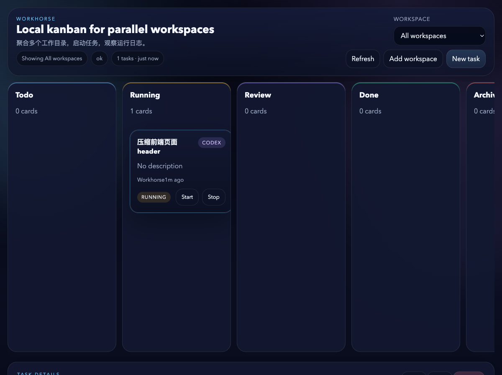

# Workhorse



Workhorse is a local-first kanban runtime for engineering work across multiple repositories.
It combines a multi-workspace board, AI and shell runners, Git worktrees, realtime logs, and PR-aware review automation in one app that runs entirely on your machine.

## Why Workhorse

- Run engineering tasks for multiple local workspaces from one board instead of juggling terminal tabs and ad hoc notes.
- Keep everything local: state lives on disk, logs are persisted, and the app serves its own API and UI from a single local port.
- Use the right executor for each task: `codex` for implementation, `claude` for planning or review, and `shell` for deterministic commands.
- Track work the way engineers actually work: each Git-backed task can target a base ref, create its own worktree and branch, and carry PR metadata through review.
- Watch progress in realtime with live run output, sticky plans, run history, diffs, and PR status in the task detail view.
- Close the review loop faster: merged PRs can move tasks to `done`, while behind/conflicting PRs, failing checks, or new review feedback can trigger follow-up runs automatically.

## What You Need

Core requirements:

- A recent Node.js LTS release and `npm`
- `git`

Optional but strongly recommended:

- `codex` CLI for Codex execution runs
- `claude` CLI for planning mode and AI review runs
- `gh` CLI authenticated with `gh auth login` for PR polling and publishing GitHub reviews
- OpenRouter credentials if you want Workhorse to auto-generate task titles and worktree names when the title is left blank

Workhorse still works without every integration enabled. For example, `shell` tasks do not require `codex`, `claude`, or `gh`.

## Quick Start

Install dependencies and start the local runtime:

```bash
npm install
npm run dev
```

Then open:

- App: [http://127.0.0.1:3999](http://127.0.0.1:3999)
- Health: [http://127.0.0.1:3999/api/health](http://127.0.0.1:3999/api/health)
- OpenAPI document: [http://127.0.0.1:3999/openapi.json](http://127.0.0.1:3999/openapi.json)

Development mode uses a single entrypoint. `npm run dev` regenerates the API client, starts the contracts watcher, and runs the server with embedded Vite middleware, so the UI and API are both available on the same port.

To do a production-style launch from source:

```bash
npm run start
```

`npm run start` already runs the full build before launching the server.

If you already have fresh build artifacts and only want to relaunch the built server without another rebuild:

```bash
npm run start --workspace @workhorse/server
```

## First Run Walkthrough

### 1. Add a workspace

Use the UI to add a local folder. You can choose it with the native folder picker or paste an absolute path manually.

If the folder is a Git repository, Workhorse unlocks the Git-aware workflow:

- choose a base ref when creating tasks
- create per-task worktrees and branches
- inspect Git status from the top bar
- attach PR status, checks, review counts, and changed files to tasks

### 2. Configure optional global settings

Open **Global settings** if you want description-only task creation:

- `language` controls the language used for AI-generated task names
- `openRouter.baseUrl`, `openRouter.token`, and `openRouter.model` are used to generate a task title and worktree name when the title is omitted

This is optional. If you always provide a task title yourself, OpenRouter is not required.

### 3. Create a task

Each task belongs to a workspace and uses one runner type:

- `codex`: implementation tasks that should edit code and finish the full engineering loop
- `claude`: planning, analysis, or review-style tasks
- `shell`: explicit commands such as `npm test`, `cargo test`, or custom scripts

For Git workspaces, select the base ref that the task should branch from, typically `origin/main`.

### 4. Plan before you run

Backlog and todo tasks can generate a plan before execution. Planning runs use Claude in `plan` mode and store the result directly on the task, so you can review it, send feedback, and only then start the implementation run.

### 5. Start the task and watch the logs

When a task starts, Workhorse moves it into the running workflow, records the run, and streams output over WebSocket. You can inspect:

- live stdout, stderr, and system events
- sticky plan updates
- run history by phase
- diffs and PR metadata for Git-backed tasks

### 6. Move through review

For Git-backed tasks, Workhorse keeps the review stage connected to GitHub:

- completed tasks can carry a PR URL and PR snapshot
- merged PRs can automatically move tasks from `review` to `done`
- behind/conflicting PRs, failing checks, unresolved conversations, or new review feedback can trigger a follow-up run from review
- manual and automatic Claude review runs can publish a GitHub review through `gh`

If `gh` is not available or not authenticated, the board still works, but GitHub polling and review publication are skipped.

## Runners At A Glance

| Runner | Best for | Requires |
| --- | --- | --- |
| `codex` | feature work, code edits, end-to-end implementation tasks | `codex` CLI |
| `claude` | planning, analysis, AI review, read-heavy workflows | `claude` CLI |
| `shell` | tests, scripts, build steps, deterministic commands | local shell only |

Workspace-level Codex settings let you choose the approval policy and sandbox mode used for future Codex runs in that workspace.

## Git And Review Workflow

Workhorse is more than a task board layered on top of a repo:

- Git workspaces expose available refs so tasks can start from a real base branch
- task worktrees are isolated, which keeps concurrent changes from stepping on each other
- PR snapshots track mergeability, review decision, required checks, changed files, and unresolved conversation counts
- review monitoring runs in the background on a timer, so the board can react when GitHub state changes
- if the runtime restarts while a task is active, the previous run is marked `canceled` and the task returns to `review`

The review monitor interval defaults to `15000` ms and can be disabled with `WORKHORSE_GIT_REVIEW_MONITOR_INTERVAL_MS=0`.

## Useful Commands

```bash
npm run dev
npm run build
npm run start
npm run test
npm run generate:openapi
npm run generate:client
npm run check:contracts
```

## Runtime Details

Default runtime settings:

- HTTP port: `3999`
- bind address: `127.0.0.1`
- local data directory: `~/.workhorse`

Persisted data:

- `~/.workhorse/state.json`: workspaces, tasks, runs, and settings
- `~/.workhorse/logs/<runId>.log`: persisted run logs

Useful environment variables:

- `WORKHORSE_PORT`: override the default HTTP port
- `WORKHORSE_DATA_DIR`: move the local state directory
- `WORKHORSE_GIT_REVIEW_MONITOR_INTERVAL_MS`: set review polling interval in milliseconds, or `0` to disable it
- `WORKHORSE_LOG_CODEX_APP_SERVER=1`: print Codex app-server logs for debugging

## Repository Layout

- `packages/contracts`: shared domain models, validators, and OpenAPI generation
- `packages/server`: Hono runtime, persistence, runners, Git/PR services, WebSocket events
- `packages/api-client`: generated OpenAPI client used by the frontend
- `packages/web`: React UI for the board, task details, logs, diffs, and settings

## Troubleshooting

### `codex` or `claude` is not found

Install the corresponding CLI locally and make sure it is available on your `PATH`. Until then, use `shell` tasks for basic command execution.

### PR features are missing

Authenticate GitHub CLI first:

```bash
gh auth login
```

Without `gh`, Workhorse cannot poll pull requests or publish review results back to GitHub.

### Running the built server returns `FRONTEND_NOT_BUILT`

This usually happens when you start the built server directly, for example with `npm run start --workspace @workhorse/server` or `node packages/server/dist/index.js`, before the web assets have been generated.

Build the web assets first:

```bash
npm run build
```

### The folder picker does not open

Use the manual path input instead. The picker depends on native OS tooling such as `osascript` on macOS, `zenity` or `kdialog` on Linux, and PowerShell on Windows.
